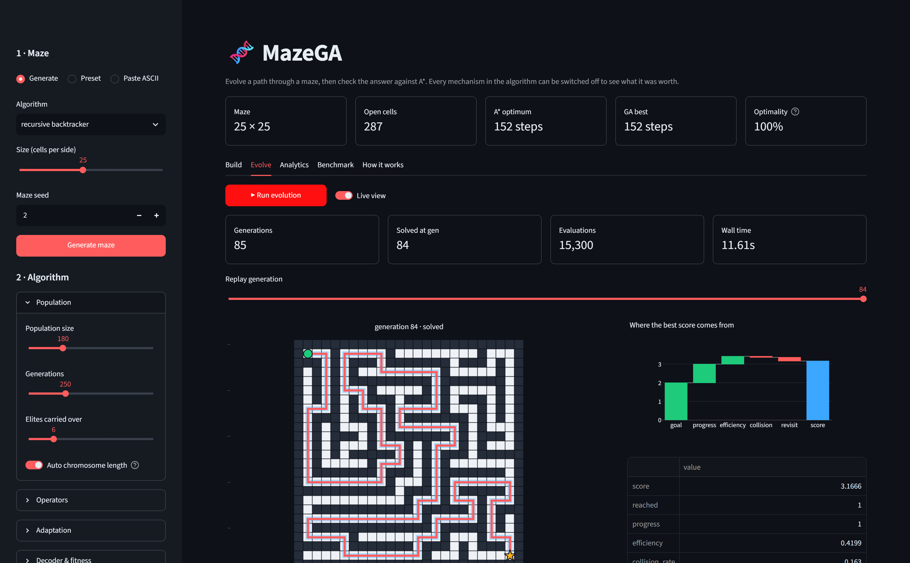
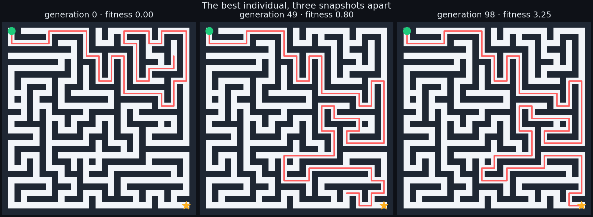
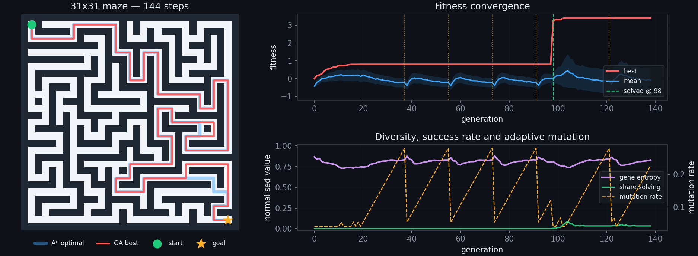
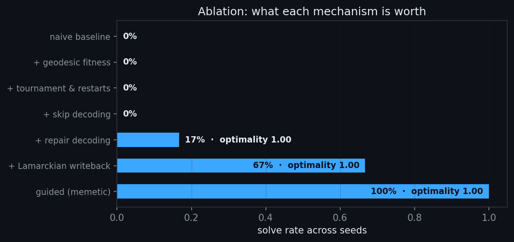
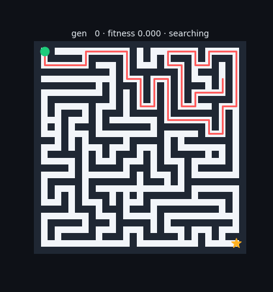

# 🧬 MazeGA — Maze Solving with a Genetic Algorithm

Evolve a path through a maze, then grade the answer against A\*. Every mechanism in the
algorithm can be switched off from the UI, so you can see exactly what each one is worth.

<p align="center">
  
</p>

```bash
pip install -r requirements.txt
streamlit run app.py            # interactive lab → http://localhost:8501
python cli.py solve --size 21   # headless run
python -m pytest -q tests       # 63 tests
```

## Features

- **Interactive lab** — click cells to edit the maze, tune 20+ parameters, watch the population evolve live
- **5 maze generators** — recursive backtracker · Prim · braided · random obstacles · open field, all guaranteed solvable
- **4 wall policies · 5 selection · 3 crossover · 4 mutation** operators, all switchable at runtime
- **Adaptive search** — elitism, mutation that ramps on stagnation, random immigrants, catastrophe restarts
- **Graded against A\*** — BFS gives the true optimum, so every run reports an *optimality ratio*
- **Ablation harness** — re-runs the same maze across seeds with one mechanism changed at a time

## How it works

A chromosome is a fixed-length string over `{U, D, L, R}`; decoding walks the maze one gene
at a time. A 200-gene chromosome spans `4²⁰⁰ ≈ 10¹²⁰` candidates.

**What happens at a wall** is the whole design problem:

| policy | behaviour | consequence |
|---|---|---|
| `strict` | the walk ends | one bad gene discards the whole tail — the naive version |
| `skip` | gene ignored, counted as a collision | later genes still get expressed |
| `repair` | rotate to the next legal move, preferring unvisited cells | no goal knowledge, so evolution still does the work |
| `guided` | step to the legal cell nearest the goal | memetic and very strong — corridor mazes become near-trivial |

**Fitness** is a weighted sum of normalised terms, so every slider is interpretable:

```
score = w_goal       ·  reached
      + w_progress   · (1 − closest_distance / start_distance)
      + w_efficiency · (optimal_steps / path_steps)
      − w_collision  ·  collision_rate
      − w_revisit    ·  revisit_rate
```

`closest_distance` is the nearest the walk *ever* came to the goal, measured by a BFS
flood-fill rather than straight-line distance. Manhattan distance creates local optima on
the wrong side of a wall — switch to it in the sidebar and watch the search stall.

<p align="center">
  
</p>

## Results

A 31×31 braided maze. Four catastrophe restarts and the sawtooth adaptive mutation rate are
visible before the breakthrough at generation 98.

<p align="center">
  
</p>

Every mechanism ablated over 6 seeds on a 25×25 maze:

<p align="center">
  
</p>

| finding | evidence |
|---|---|
| **Chromosome length dominates every other knob** | over 20 instances, solve rate goes 35% → 55% → 85% → 90% as the genome grows from 1.0× to 3.0× the shortest path. Below 1.0× the optimum is literally unrepresentable. |
| Decoding matters more than the operators | `strict` and `skip` never solve a 25×25 maze in 150 generations; `repair` does |
| Lamarckian write-back is worth ~4× the solve rate | 17% → 67% on the same maze and seeds |
| The GA matches A\* when it succeeds | optimality ratio is 1.00 on every solved trial up to 25×25 |

Reproduce the first row with `python scripts/chromosome_study.py`.

**Honest limit.** Beyond roughly 25×25 the walk has to be near-perfect over hundreds of
genes and the plain operators stall — `guided` decoding is what carries larger instances. A
genetic algorithm is the wrong tool for shortest paths; it is a very good way to *see* how
one behaves.

<p align="center">
  
</p>

## Usage

```bash
python cli.py solve --size 25 --maze-seed 2 --save out/run.png
python cli.py solve --preset "Serpentine trap" --decode strict --heuristic manhattan
python cli.py bench --seeds 6 --save out/ablation.png
python cli.py gif   --out out/evolution.gif
```

```python
from mazega import GAConfig, astar, generate, solve

maze   = generate("braided", 31, 31, seed=1)
result = solve(maze, GAConfig(population=180, generations=300, decode="repair"))

result.summary()      # solved, generations, optimality, evaluations…
result.simple_path    # loop-free list of (row, col)
astar(maze).steps     # the exact optimum to compare against
```

## Layout

```
app.py          Streamlit UI (build · evolve · analytics · benchmark)
cli.py          command-line front end
mazega/         maze · search · genome · fitness · operators · ga · benchmark · plots
scripts/        regenerate the figures, screenshots and studies in this README
tests/          63 tests
legacy/         the original prototype this grew from
```

One `seed` fixes the maze, the initial population and every operator draw, so runs are
fully reproducible.

## Regenerating the figures

```bash
python scripts/make_figures.py                       # charts + GIF
pip install playwright && playwright install chromium
python scripts/make_screenshots.py                   # UI screenshots
```

## License

MIT
